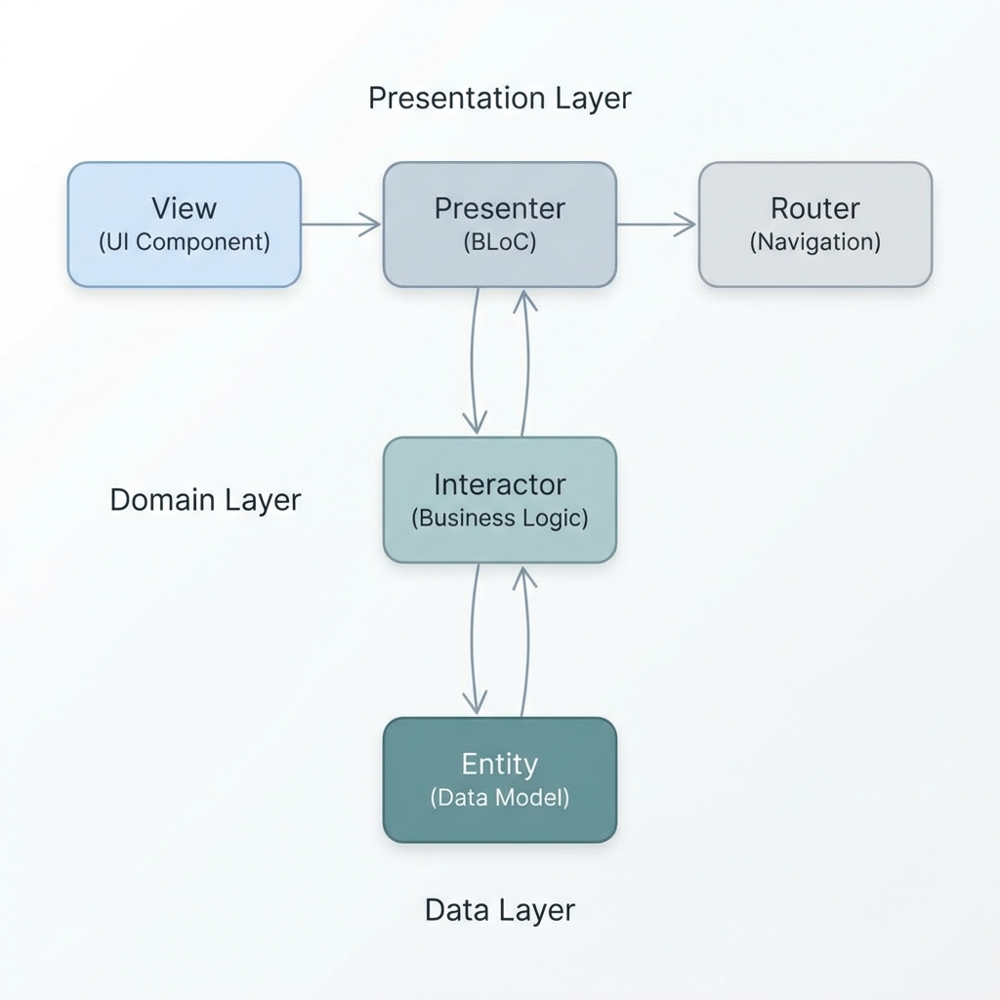
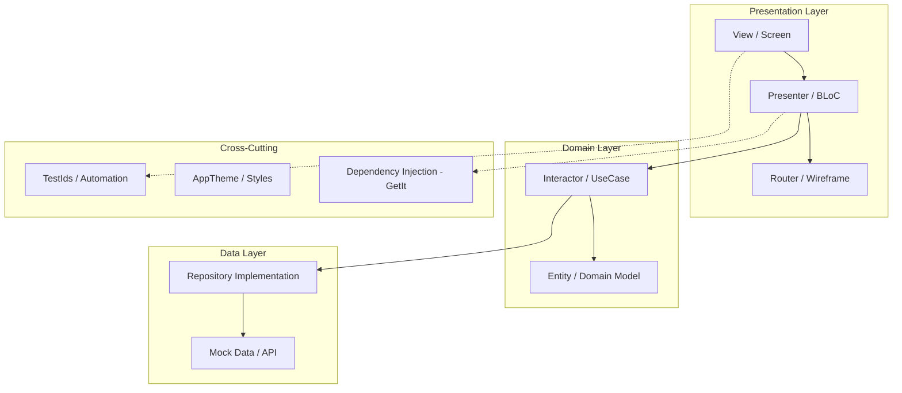

# EduTrack Project Documentation

## 📖 Overview
**EduTrack** is a high-performance student portal application designed specifically for **Automation Testing**. It leverages modern software engineering principles to ensure maintainability, scalability, and ease of testing.

---

## 🏗️ Architecture: VIPER + DDD + SOLID

The project follows a strict **VIPER** (View, Interactor, Presenter, Entity, Router) architecture, integrated with **Domain-Driven Design (DDD)** and enforced by **SOLID** principles.

### 📐 Architecture Diagram



### 📐 Mermaid Source (fallback)



### 🧩 Module Breakdown

| Module | Responsibility | VIPER Components |
| :--- | :--- | :--- |
| **Auth** | Student Login & Session | `AuthBloc`, `AuthInteractor`, `AuthRouter` |
| **Dashboard** | Performance Overview | `DashboardBloc`, `DashboardInteractor`, `DashboardRouter` |
| **Courses** | Enrollment Management | `CoursesBloc`, `CoursesInteractor`, `CoursesRouter` |
| **Attendance** | Subject-wise Analytics | `AttendanceInteractor`, `AttendanceRouter` |
| **Marks** | Result Visualizations | `MarksInteractor`, `MarksRouter` |
| **Profile** | Identity Management | `ProfileInteractor`, `ProfileRouter` |

---

## 🧪 Automation Strategy

The application is "Automation-First." We use **Flutter Semantics** to expose stable identifiers to testing frameworks like **Playwright**.

### Important Test Identifiers
Centralized in `lib/core/test_ids.dart`:
- `student_id_input`: Login field for Student ID.
- `password_input`: Login field for Password.
- `login_button`: Main authentication trigger.
- `dashboard_title`: Verification point for successful entry.
- `enroll_button`: Action trigger in the Course list.

---

## 🛠️ Technical Stack
- **Framework**: Flutter (Dart)
- **State Management**: flutter_bloc
- **Dependency Injection**: get_it
- **UI/Layout**: flutter_screenutil, google_fonts
- **Visuals**: percent_indicator, Material 3

---

## 🚀 How to Run & Test

### Run Application
```bash
flutter run
```

### Run Analysis (Linting)
```bash
flutter analyze
```

### Playwright Integration (Sample)
```javascript
test('student login and enroll course', async ({ page }) => {
  await page.goto('http://localhost:8080'); // Assuming web build
  await page.getByLabel('student_id_input').fill('STU1001');
  await page.getByLabel('password_input').fill('123456');
  await page.getByLabel('login_button').click();
  await expect(page.getByLabel('dashboard_title')).toBeVisible();
});
```
